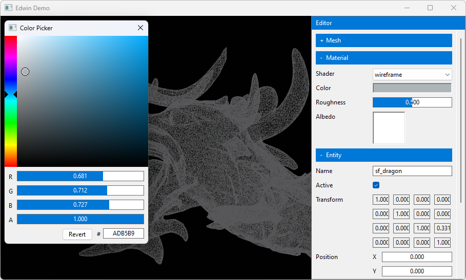
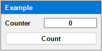

Edwin
=====

A small C/C++ graphical user interface library for creating debug editors for
Windows applications. Variables can be bound to input controls to modify them,
making exposed variables easy to tweak at runtime.

Usage
-----

~~~cpp
#include "edwin.h"

static ed_node *counter;
static int count;

void
count_onclick(ed_node *button)
{
    ++count;

    // Update counter input (redraw).
    ed_data(counter, &count);
}

void
counter_example()
{
    // Create a centered 200x100 window.
    ed_begin_window("Example", ED_VERT, 0.5f, 0.5f, 200, 100);
    {
        // Create a labeled input field.
        counter = ed_input("Counter", ED_INT);

        // Create a button taking up 100% of the parent width.
        ed_push_rect(0, 0, 1.0f, 0);
        ed_button("Count", count_onclick);
    }
    ed_end();
}
~~~

Installation
------------

Build `edwin.c` and link it with your executable. `edwin.c` uses a subset of C
which can be compiled with either a C99 or C++ compiler.

~~~
cl /W4 /std:c11 /c edwin.c
link /subsystem:windows user32.lib gdi32.lib comctl32.lib msimg32.lib edwin.obj your_app.obj
~~~
